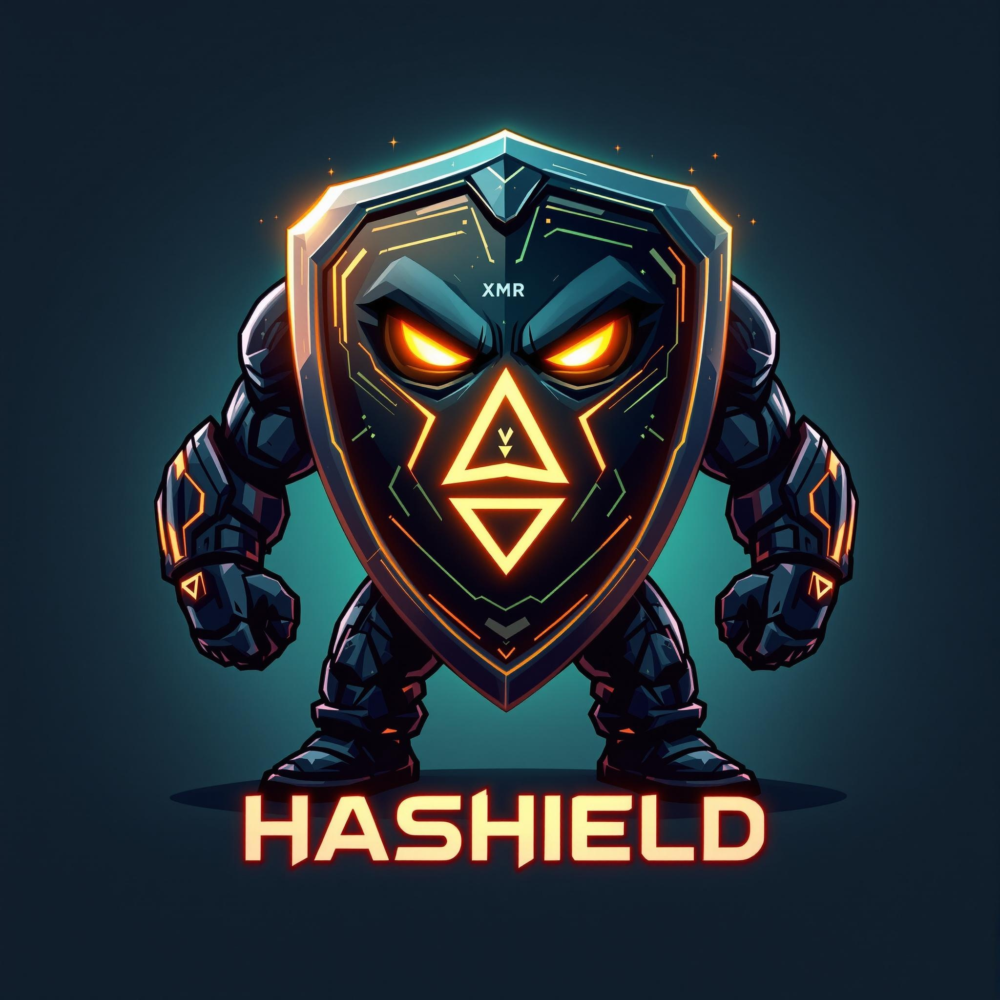

<div align="center">
  
</div>

# 🛡️ Hashield: Private web3 browsing built on Monero-Ethereum atomic swaps

## 🏗️ Project Overview

Hashield is a privacy-by-default web3 wallet browser extension built on Monero-Ethereum atomic swaps. It combines:

- Chromium web3 extension providing automatic address cycling for privacy
- ETH ↔ XMR atomic swap protocol for trustless cross-chain transactions
- 1inch cross-chain swap interfaces for enhanced interoperability

To make this project I smashed together three existing projects: 

- [Hashlocked](https://ethglobal.com/showcase/hashlocked-jwaq6) – Fusion + BTC<>EVM Swaps
- [PrivacyLinks](https://ethglobal.com/showcase/privacylinks-y30gr) – Chromium web3 extension providing automatic address cycling
- [ETH-XMR Atomic Swaps](https://github.com/AthanorLabs/atomic-swap) – open-source ETH ↔ XMR swap protocol

The end result is a privacy-focused web3 wallet that enables secure, atomic swaps between EVM chains and Monero.

- **EVM Side**: Smart contracts with deterministic factory deployment and adapter pattern
  - Address spoofing for dApp compatibility while maintaining privacy
  - Relayer system for funding fresh wallets with each transaction
- **Monero Side**: Native Monero cryptographic primitives for secure transactions
  - Adapter signatures to enforce timelock guarantees across chains
  - Integrated Monero wallet functionality within the extension
- **Atomic Guarantee**: Either both parties get their desired assets, or both get refunded

### 🔄 Supported Swap Directions

1. **EVM → XMR**: Trade ETH/ERC20 tokens for Monero
2. **XMR → EVM**: Trade Monero for ETH/ERC20 tokens

## 🧱 Technical Components

### Smart Contracts (EVM)
- `XMREscrowSrc`: Source escrow adapter contract connecting with 1inch cross-chain swap interfaces
- `XMREscrowDst`: Destination escrow adapter contract for cross-chain swaps
- `Resolver`: Deploys escrow contracts and handles relayer fee calculation
- `SwapCreator`: Implementation of ETH-XMR atomic swap contract
- `AmountGetterWithFee`: Calculates order prices for XMR-ETH swaps including relayer fees
- **Deployed on Base Sepolia**:
  - SwapCreator: [`0x212072CB504Dc2fBF6477772B8E318D286B80e35`](https://sepolia.basescan.org/address/0x212072CB504Dc2fBF6477772B8E318D286B80e35)
  - XMREscrowSrc: [`0x8c39940feBc35F0A44868c3B3E138C58989944a1`](https://sepolia.basescan.org/address/0x8c39940feBc35F0A44868c3B3E138C58989944a1)
  - XMREscrowDst: [`0xA81283f4E4FB8eDd1cF497C09ABcFa8bBe9289Ea`](https://sepolia.basescan.org/address/0xA81283f4E4FB8eDd1cF497C09ABcFa8bBe9289Ea)
  - Resolver: [`0x569961856A3f66788D29e70aeaB7400f11895f4A`](https://sepolia.basescan.org/address/0x569961856A3f66788D29e70aeaB7400f11895f4A)
  - LimitOrderProtocol: [`0xE53136D9De56672e8D2665C98653AC7b8A60Dc44`](https://sepolia.basescan.org/address/0xE53136D9De56672e8D2665C98653AC7b8A60Dc44)
  - AmountGetterWithFee: [`0xf3Cb12aF6C50999cF5Cc5A4434166CBFAC75398B`](https://sepolia.basescan.org/address/0xf3Cb12aF6C50999cF5Cc5A4434166CBFAC75398B)

### Key Features
- ✅ **Modular Architecture**: Adapter pattern for easy integration and upgrades
- ✅ **1-inch Compatible**: Interface compatibility for aggregator integration
- ✅ **Privacy-Preserving**: Works with Monero's privacy features
- ✅ **Cross-Chain**: Atomic swaps between EVM chains and Monero
- ✅ **Relayer Transactions**: Specialized relayer system that funds fresh wallets for anonymous wallet funding

## 🚀 Development Setup

### Prerequisites
```bash
# Git
git --version

# Foundry
forge --version
```

### Installation
```bash
# Clone the repository with submodules
git clone https://github.com/madschristensen99/hashield.git
cd hashield
git submodule update --init --recursive

# If you're setting up from scratch, add the required submodules:
git submodule add https://github.com/1inch/cross-chain-swap.git contracts/cross-chain-swap
git submodule add https://github.com/foundry-rs/forge-std.git lib/forge-std
git submodule add https://github.com/OpenZeppelin/openzeppelin-contracts.git lib/openzeppelin-contracts

# Initialize and update submodules within cross-chain-swap
cd contracts/cross-chain-swap && git submodule init && git submodule update
cd ../..

# Initialize and update submodules within xmr-eth-atomic-swaps
cd xmr-eth-atomic-swaps && git submodule init && git submodule update
cd ..
```

### Compiling Contracts
```bash
# Compile all contracts (may have dependency issues)
forge build

# Compile specific contracts (recommended approach)
forge build --contracts contracts/XMREscrowSrc.sol --skip cross-chain-swap

# Compile with IR pipeline to resolve stack too deep errors
forge build --contracts contracts/XMREscrowSrc.sol --skip cross-chain-swap --via-ir
```

> **Note**: Due to dependency issues in the cross-chain-swap submodule, you should use the `--skip cross-chain-swap` flag when compiling or deploying contracts. This skips the problematic dependencies while still correctly compiling our contracts.

> **Important**: The XMREscrowSrc and XMREscrowDst contracts require the `--via-ir` flag for compilation due to their complexity. The IR-based compiler pipeline helps resolve "Stack too deep" errors by using a more sophisticated intermediate representation and better register allocation.

### Testing
```bash
# Run tests
forge test

# Run tests with verbosity
forge test -vvv
```

### Deployment

The `deploy-direct.sh` script handles the deployment of all required contracts in the correct order and verifies them on BaseScan:

```bash
# Set up environment variables in .env file first
# Required variables: PRIVATE_KEY, ETHERSCAN_API_KEY

# Deploy all contracts to Base Sepolia using the script
./deploy-direct.sh
```

The script will deploy the following contracts in sequence:
1. SwapCreator
2. XMREscrowSrc (with SwapCreator address as constructor argument)
3. XMREscrowDst (with SwapCreator address as constructor argument)
4. Resolver (with XMREscrowSrc, LimitOrderProtocol, and deployer addresses as constructor arguments)

All contracts will be automatically verified on BaseScan (except for SwapCreator due to compiler version limitations).

For manual deployment, you can use:

```bash
# Manual deployment with the --skip flag
forge create contracts/XMREscrowSrc.sol:XMREscrowSrc --skip cross-chain-swap --via-ir --constructor-args <SWAP_CREATOR_ADDRESS> --private-key $PRIVATE_KEY --rpc-url $BASE_SEPOLIA_RPC_URL --legacy
```

> **Note**: The `--via-ir` flag is required when deploying the XMREscrowSrc and XMREscrowDst contracts to use Solidity's IR-based compiler pipeline, which resolves stack too deep errors.

## 🔐 Cryptographic Flow

### Atomic Swap Guarantee
1. **Setup Phase**: Both parties lock assets
2. **Claim Phase**: First claimer reveals secret, second uses revealed secret
3. **Safety**: If either fails, both get refunded after timelock

## 🛡️ Security Features

### Key Protections
- **No Counterparty Risk**: Trustless execution
- **Atomic Guarantee**: Both succeed or both fail
- **Time Boundaries**: Configurable timelock periods

## 🔧 Configuration

### Network Support
- **EVM**: Base Sepolia (testnet), easily extendable to mainnet and other EVM chains
- **Monero**: Stagenet, ready for mainnet

## 📁 Project Structure

```
hashield/
├── contracts/                  # Smart contracts
│   ├── XMREscrowSrc.sol       # Source escrow adapter for 1inch interfaces
│   ├── XMREscrowDst.sol       # Destination escrow adapter for 1inch interfaces
│   ├── atomic-swap/            # Symbolic link to xmr-eth-atomic-swaps/ethereum
│   └── cross-chain-swap/       # 1inch cross-chain-swap submodule
├── lib/                        # External libraries
│   ├── forge-std/              # Foundry standard library
│   └── openzeppelin-contracts/ # OpenZeppelin contracts
├── xmr-eth-atomic-swaps/       # Atomic swap implementation
├── extension/                  # Browser extension code
└── foundry.toml                # Foundry configuration
```
